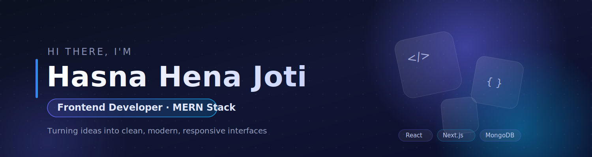

  

<!-- <h1 align="center">Hi, I'm Hasna Hena Joti 👋</h1> -->

  

---

## 👩‍💻 About Me

I'm a frontend-focused developer who enjoys building clean, modern web interfaces with React and Next.js. I care a lot about polished UI, smooth interactions, and writing code that's easy to maintain. Currently completing my B.Tech in Computer Science Engineering, I'm working toward becoming a strong full-stack developer with a growing interest in AI-integrated applications.

- 📍 Based in Dhaka, Bangladesh
- 📧 Email: **hasnahenajoti1414@gmail.com**
- 🌐 Portfolio: [joti-portfolio.vercel.app](https://joti-portfolio.vercel.app)

---

## 🚀 What I'm Up To

- 🔭 I'm currently building full-stack projects with **Next.js, Express, and MongoDB**
- 🌱 I'm learning **TypeScript** and strengthening my JavaScript fundamentals
- 🎨 I love working on **modern UI** with dark themes, glassmorphism, and subtle animations
- 🤖 I'm exploring **AI integrations** in web apps as my next step
- 💬 Ask me about React, Next.js, or building responsive interfaces

---

## 🛠️ Skills & Tools

**Frontend**

**Backend**

**Tools**

---

## 🔗 Connect With Me

  
  
  
  

---

## 📊 GitHub Stats

  

  

---

  <i>Thanks for visiting! Feel free to check out my pinned projects below. ⭐</i>

